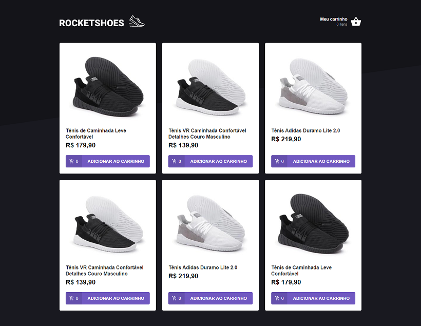
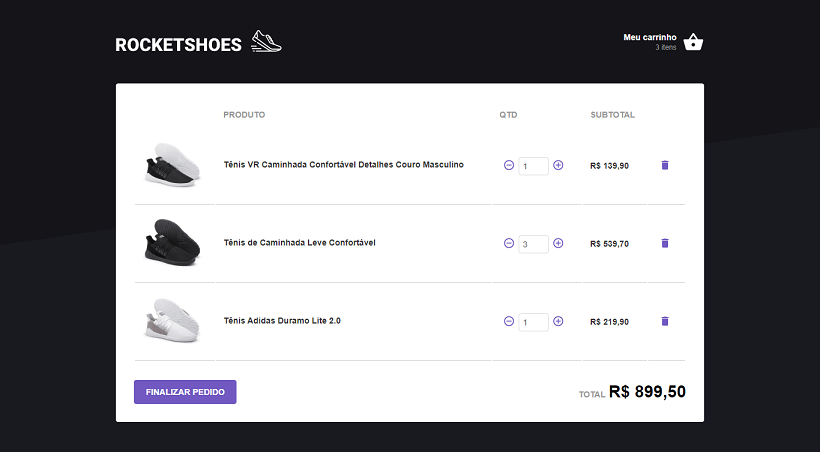

<h1 align="center">
	Rocketshoes
</h1>

 

  

<h4 align="center">
  Guilherme Fünkler Borelli
</h4>

  <a href="#wrench-tecnologias">Tecnologias</a>&nbsp;&nbsp;&nbsp;|&nbsp;&nbsp;&nbsp;
  <a href="#-projeto">Projeto</a>&nbsp;&nbsp;&nbsp;|&nbsp;&nbsp;&nbsp;
  <a href="#-instruções">Instruções</a>

## :wrench: Tecnologias

Esse projeto foi desenvolvido com as seguintes tecnologias:

- [React](https://reactjs.org)
- [Redux](https://redux.js.org/)
- Diversas bibliotecas como Redux-Saga, Styled Components, React Icons, etc

## 💻 Projeto

O projeto que visa simular o front-end de um e-commerce.

## 📚 Instruções

Para rodar a aplicação utilizar o comando 'yarn' ou 'npm i' (o que você utilizar) no diretório 'rocketshoes', após concluída a instalação dos pacotes, no diretório 'rocketshoes' utilizar os comandos 'json-server server.json -p 3333' e 'yarn start'/'npm start', a aplicação iniciará automaticamente.
